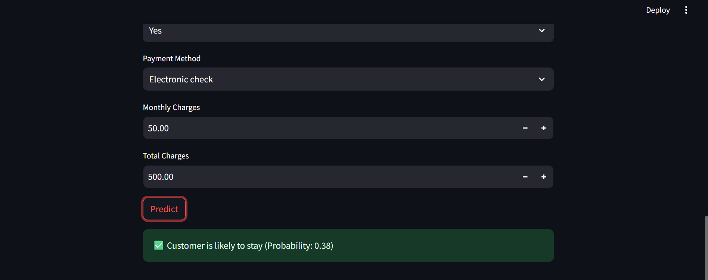

# 📊 Customer Churn Prediction — End-to-End ML Project

> Predict whether a telecom customer will churn using machine learning — with a real-time interactive Streamlit app.




---

## 🚀 Problem Statement

Customer churn is one of the most critical challenges in telecom and subscription-based businesses. Losing a customer is 5–10x more expensive than retaining one. This project builds a machine learning system to **predict churn before it happens**, enabling businesses to take proactive retention actions.

---

## 🎯 Project Highlights

- Trained and compared **3 ML models**: Logistic Regression, Random Forest, XGBoost
- Best model achieved **ROC-AUC of 0.83** on the test set
- Built a **real-time prediction app** using Streamlit — no coding needed to use
- Complete **end-to-end pipeline**: raw data → EDA → preprocessing → training → deployment

---

## 🗂️ Project Structure

```
customer-churn/
│
├── data/                   # Raw dataset (Kaggle)
│
├── src/
│   ├── eda.py              # Exploratory Data Analysis
│   ├── preprocess.py       # Data cleaning & feature engineering
│   ├── train.py            # Model training & comparison
│   └── predict.py          # Prediction logic using saved model
│
├── models/
│   └── model.pkl           # Best trained model (Logistic Regression)
│
├── screenshots/            # App screenshots
│   ├── image-1.png
│   ├── image-2.png
│   ├── image-3.png
│   ├── image-4.png
│   └── image-5.png
│
├── app.py                  # Streamlit UI for real-time prediction
├── requirements.txt
├── .gitignore
└── README.md
---

## 📦 Dataset

- **Source:** [Telco Customer Churn — Kaggle](https://www.kaggle.com/datasets/blastchar/telco-customer-churn)
- **Size:** 7,043 customers × 21 features
- **Features:** Customer demographics, services subscribed, billing info, contract type
- **Target:** `Churn` — Yes / No

---

## 🔄 Project Pipeline

### 1. Exploratory Data Analysis (`eda.py`)
- Checked for missing values and class imbalance
- Found `TotalCharges` stored as object — fixed datatype
- Analyzed churn rate by contract type, tenure, and monthly charges

### 2. Data Preprocessing (`preprocess.py`)
- Handled missing values in `TotalCharges`
- Label encoded binary columns
- One-hot encoded multi-category columns
- Scaled numerical features using `StandardScaler`

### 3. Model Training (`train.py`)
- Trained 3 models and compared performance:

| Model | Accuracy | Precision | Recall | F1 Score | ROC-AUC |
|---|---|---|---|---|---|
| Logistic Regression | 0.7889 | 0.6238 | 0.5187 | 0.5664 | **0.8320** ✅ |
| Random Forest | 0.7711 | 0.5915 | 0.4492 | 0.5106 | 0.8047 |
| XGBoost | 0.7655 | 0.5687 | 0.4866 | 0.5245 | 0.8101 |

- **Best Model: Logistic Regression** (highest ROC-AUC → 0.8320)
- Saved trained model as `models/model.pkl`

### 4. Prediction (`predict.py`)
- Loads saved model pipeline
- Accepts new customer data and returns churn probability + label

### 5. Streamlit App (`app.py`)
- Interactive UI — fill in customer details and get instant churn prediction
- Business-ready: designed for non-technical users

---

## ▶️ How to Run

```bash
# 1. Clone the repository
git clone https://github.com/Aryansingh-B/customer-churn.git
cd customer-churn

# 2. Install dependencies
pip install -r requirements.txt

# 3. Run the app
streamlit run app.py
```

---

## 🔥 Key Learnings

- Handling real-world data issues (wrong datatypes, missing values)
- Building end-to-end sklearn pipelines
- Model comparison using multiple metrics — not just accuracy
- Deploying ML models with Streamlit for business use

---

## 📌 Future Improvements

- [ ] Hyperparameter tuning with `GridSearchCV`
- [ ] Feature engineering (e.g., tenure buckets, charge ratios)
- [ ] Model explainability using **SHAP values**
- [ ] Deploy on Streamlit Cloud for public access

---

## 👨‍💻 Author

**Aryan Singh Bais**  
Aspiring Data Scientist & ML Enthusiast | Python · SQL · Power BI · Streamlit  
[GitHub](https://github.com/Aryansingh-B) • [LinkedIn](https://linkedin.com/in/aryansinghbais8)

---

> *"Built to solve a real business problem — not just to pass a course."*
