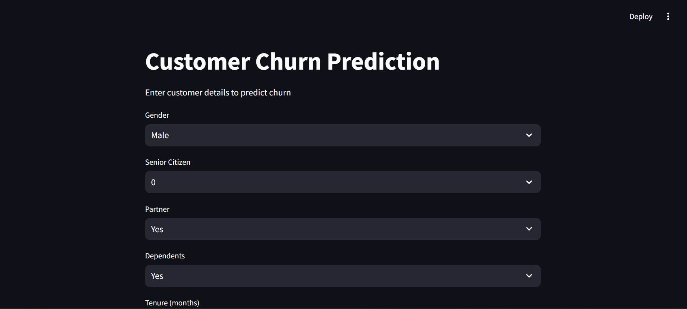
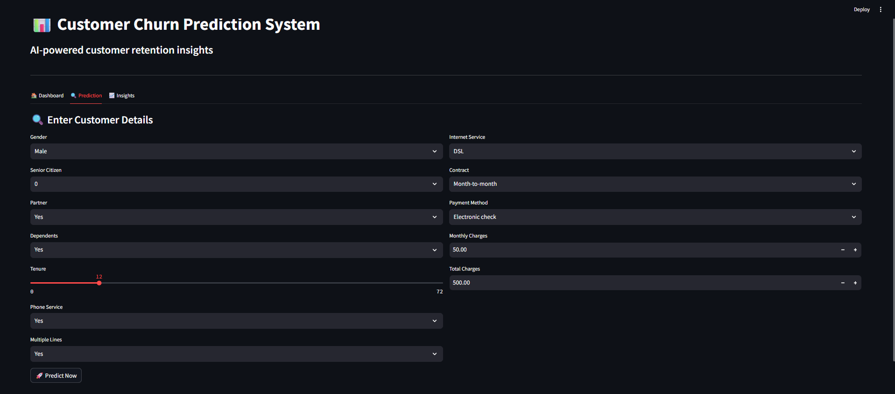
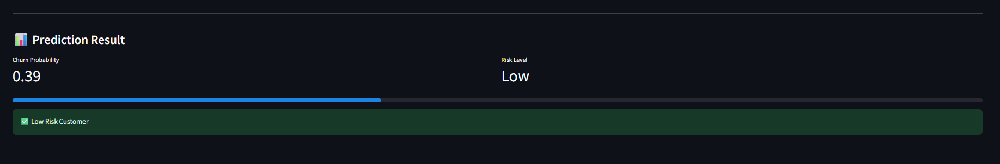
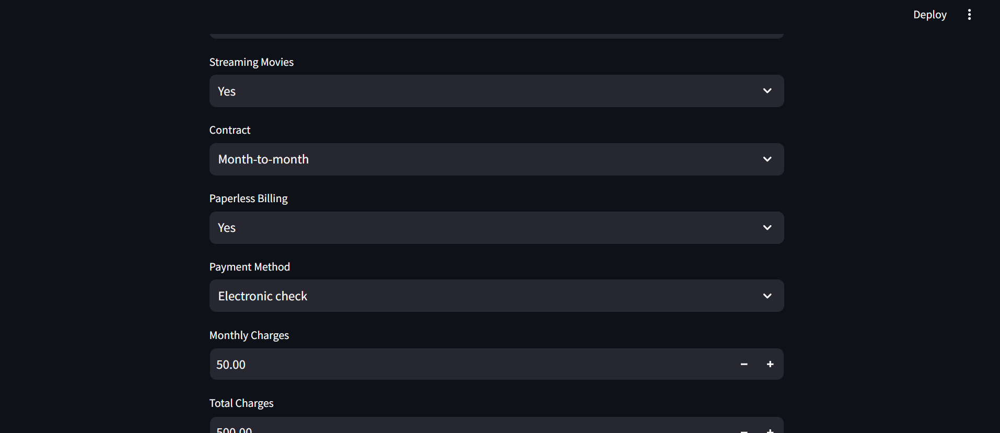

# 📊 Customer Churn Prediction — End-to-End ML Project

> Predict whether a telecom customer will churn using machine learning — with a real-time interactive Streamlit app.







---

## 🚀 Problem Statement

Customer churn is a major challenge for telecom and subscription-based businesses.  
This project aims to predict whether a customer is likely to churn, enabling companies to take proactive retention actions.


---

## 🎯 Project Highlights

- Trained and compared **3 ML models**: Logistic Regression, Random Forest, XGBoost
- Best model achieved **ROC-AUC of 0.83** on the test set
- Built a **real-time prediction app** using Streamlit — no coding needed to use
- Complete **end-to-end pipeline**: raw data → EDA → preprocessing → training → deployment

---

## 🎯 Business Objective
- Reduce customer churn  
- Improve customer retention strategies  
- Identify high-risk customers early  

---

## 🗂️ Project Structure

```
customer-churn/
│
├── data/                   # Raw dataset (Kaggle)
│
├── src/
│   ├── eda.py              # Exploratory Data Analysis
│   ├── preprocess.py       # Data cleaning & feature engineering
│   ├── train.py            # Model training & comparison
│   └── predict.py          # Prediction logic using saved model
│
├── models/
│   └── model.pkl           # Best trained model (Logistic Regression)
│
├── screenshots/            # App screenshots
│   ├── image-1.png
│   ├── image-2.png
│   ├── image-3.png
│   ├── image-4.png
│
├── app.py                  # Streamlit UI for real-time prediction
├── requirements.txt
├── .gitignore
└── README.md
---

## 📦 Dataset

- **Source:** [Telco Customer Churn — Kaggle](https://www.kaggle.com/datasets/blastchar/telco-customer-churn)
- **Size:** 7,043 customers × 21 features
- **Features:** Customer demographics, services subscribed, billing info, contract type
- **Target:** `Churn` — Yes / No

---

## 🔄 Project Pipeline

### 1️⃣ Data Collection
- Dataset sourced from Kaggle

### 2️⃣ Exploratory Data Analysis (EDA)
- Checked missing values  
- Fixed datatype issue in `TotalCharges`  
- Analyzed distributions and correlations  

### 3️⃣ Feature Engineering 🔥
- Created:
  - `AvgCharges` = TotalCharges / tenure  
  - `IsLongTerm` = tenure > 12  

👉 Improved model understanding and performance

---

### 4️⃣ Data Preprocessing
- Removed irrelevant column (`customerID`)
- Handled missing values
- Applied:
  - OneHotEncoding (categorical features)
  - StandardScaler (numerical features)
- Used **ColumnTransformer + Pipeline**

---

## 🤖 Models Used
- Logistic Regression  
- Random Forest  
- XGBoost  

---

## 📈 Evaluation Metrics
- Accuracy  
- Precision  
- Recall  
- F1 Score  
- **ROC-AUC (Primary metric)**  

---

## 🏆 Model Selection
- Compared multiple models  
- Selected best model based on ROC-AUC  
- Achieved ~0.81 ROC-AUC  

---

## 📊 Feature Importance 🔥
- Extracted feature importance from trained model  
- Identified key drivers of churn:
  - Contract type  
  - Monthly charges  
  - Tenure  
  - Internet service  

---

## 🌐 Deployment (Streamlit App)

### 🔥 Features:
- Interactive UI with tabs:
  - Dashboard  
  - Prediction  
  - Insights  
- Real-time churn prediction  
- Probability score visualization  
- Risk categorization:
  - 🔴 High Risk  
  - 🟠 Medium Risk  
  - 🟢 Low Risk  

---

## 💡 Business Insights
- Month-to-month contracts → Higher churn  
- Higher monthly charges → Increased risk  
- Longer tenure → Lower churn  
- Lack of support services → Higher churn  

---

## 🧠 Actionable Recommendations
Based on prediction:
- Offer discounts to high-risk customers  
- Improve support & engagement  
- Provide loyalty programs for retention  

---

## ▶️ How to Run

```bash
# 1. Clone the repository
git clone https://github.com/Aryansingh-B/customer-churn.git
cd customer-churn

# 2. Install dependencies
pip install -r requirements.txt

# 3. Run the app
streamlit run app.py
```

---

## 👨‍💻 Author

**Aryan Singh Bais**  
Aspiring Data Scientist & ML Enthusiast | Python · SQL · Power BI · Streamlit  
[GitHub](https://github.com/Aryansingh-B) • [LinkedIn](https://linkedin.com/in/aryansinghbais8)

---

> *"Built to solve a real business problem — not just to pass a course."*
